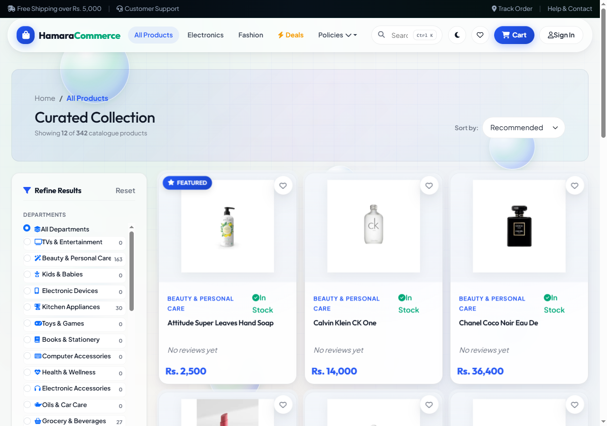
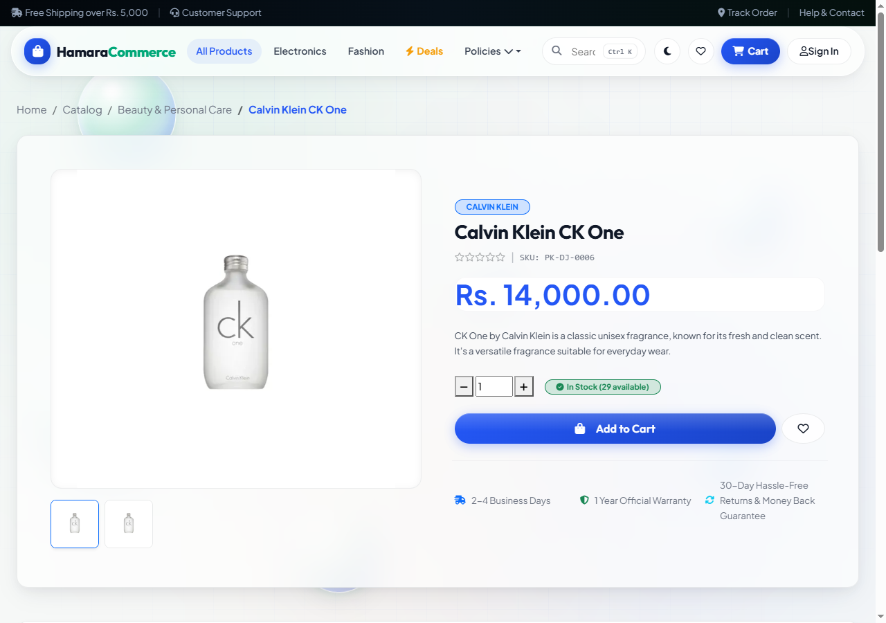
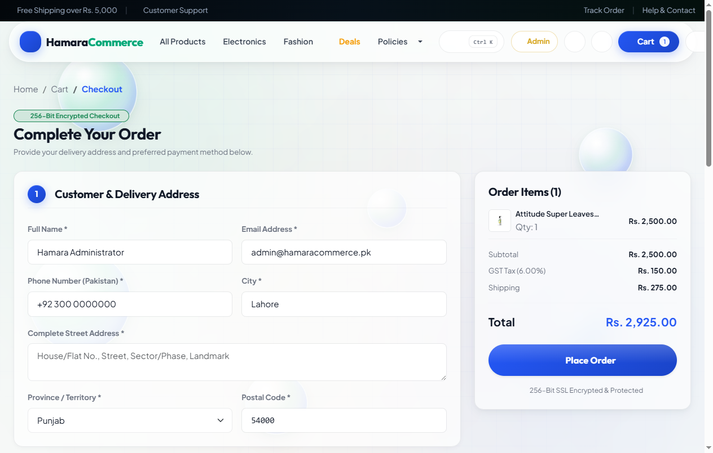
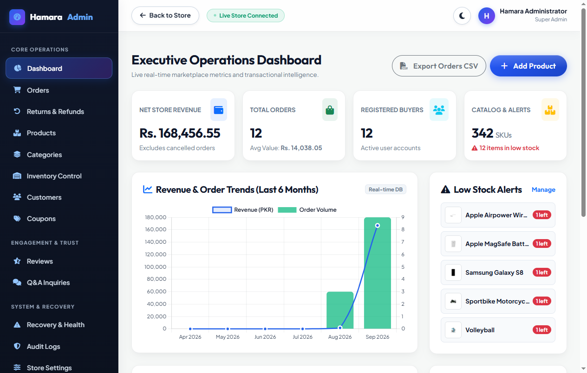

# Hamara Commerce

Hamara Commerce is a full-featured e-commerce and retail platform demonstration built with ASP.NET Core MVC on .NET 9 and Microsoft SQL Server. Developed as an in-depth software engineering portfolio project, it demonstrates realistic system architecture beyond basic CRUD operations: concurrency-safe inventory adjustments, idempotent checkout processing, multi-stage returns and refund governance, transactional email outbox recovery, and a modern customer storefront.

[Source Code](https://github.com/abdullahazaam/Hamara-Ecommerce)

---

## Visual Tour

### Storefront Homepage

*Homepage with category navigation, department highlights, real local pricing in PKR, and transparent stock counts.*

### Product Catalogue & Search

*Faceted filtering by category, brand, rating, and stock status with server-side pagination.*

### Product Details & Customer Feedback

*Comprehensive product specifications, variant selection, delivery estimates, customer reviews, and moderated Q&A.*

### Multi-Step Secure Checkout

*Checkout flow featuring pre-filled customer address details, real-time GST and shipping calculation, and idempotency protection.*

### Mobile Responsive Experience

*Fully responsive storefront optimized for handheld devices and mobile viewports.*

### Operations & Administration Dashboard

*Executive dashboard providing sales trends, low-stock notifications, audit logs, and catalog control.*

---

## Core System Highlights

- **Concurrency-Safe Inventory & Checkout**: Prevents overselling under high-contention concurrent checkouts using database locking, stock reservation, and idempotency tokens.
- **Return & Refund Governance**: Explicit multi-state return workflow (`Requested` &rarr; `Approved` &rarr; `Inspected` &rarr; `RefundPending` &rarr; `Completed`). Requires authentic remittance references, restocks inventory idempotently, and prohibits arbitrary automatic balance adjustments.
- **Operational Recovery & Email Outbox**: Reliable asynchronous messaging using the Transactional Outbox Pattern. Atomic leasing prevents duplicate sends, while administrator-supervised recovery handles failed or stalled dispatches.
- **Review & Question Moderation**: New product reviews and customer inquiries enter moderation before publication. Verified-purchase badges strictly require an order owned by that customer with confirmed payment.
- **Category Hierarchy Safety**: Prevents self-parenting and ancestor cycles during tree manipulation, paired with optimized grouped queries that eliminate N+1 database roundtrips.
- **Customer Privacy & IDOR Prevention**: Comprehensive authorization barriers protecting order history, PDF invoices, saved shipping addresses, and personal account details.

---

## Technology Stack

- **Backend**: ASP.NET Core 9 (MVC Architecture)
- **Language**: C# 13
- **Data Access**: Entity Framework Core 9 (Code-First with Additive Migrations)
- **Database**: Microsoft SQL Server / LocalDB
- **Authentication**: ASP.NET Core Identity with role-based authorization
- **Frontend**: Razor Views, Bootstrap 5, Custom CSS Design System, Vanilla JavaScript
- **Testing**: xUnit, Moq, Microsoft.AspNetCore.Mvc.Testing, VSTest
- **Continuous Integration**: GitHub Actions (separating environment-independent and real SQL Server integration test jobs)

---

## Getting Started

### Prerequisites
- [.NET 9.0 SDK](https://dotnet.microsoft.com/download/dotnet/9.0)
- Microsoft SQL Server 2019+ or Windows LocalDB (included with Visual Studio)

### Installation & Setup

1. **Clone the repository**:
   ```bash
   git clone https://github.com/abdullahazaam/Hamara-Ecommerce.git
   cd Hamara-Ecommerce
   ```

2. **Configure Database Connection**:
   By default, the application connects to Windows LocalDB:
   ```json
   "ConnectionStrings": {
     "DefaultConnection": "Server=(localdb)\\mssqllocaldb;Database=HamaraCommerceDb;Trusted_Connection=True;MultipleActiveResultSets=true;TrustServerCertificate=True"
   }
   ```
   To use a custom SQL Server instance, set the connection string using .NET User Secrets or environment variables (see table below).

3. **Restore and Build**:
   ```bash
   dotnet restore
   dotnet build --configuration Release
   ```

4. **Apply Database Migrations & Initial Seed**:
   Database migrations apply automatically on application startup. To apply them manually:
   ```bash
   dotnet ef database update
   ```

5. **Run the Application**:
   ```bash
   dotnet run
   ```
   Open `http://localhost:5000` (or the URL displayed in the console) in your web browser.

---

## Environment Variables & Configuration

Configuration settings can be provided via `appsettings.json`, environment variables, or `.NET User Secrets`:

> **Development-only credentials:** The seeded administrator email and password below are provided only for local development and portfolio evaluation. They must be replaced through secure configuration and must never be used in production.

| Variable / Key | Description | Default / Example |
| :--- | :--- | :--- |
| `ConnectionStrings__DefaultConnection` | Primary SQL Server connection string | `Server=(localdb)\mssqllocaldb;Database=HamaraCommerceDb;...` |
| `HAMARA_TEST_SQL_CONNECTION` | Connection string for real SQL integration tests | Defaults to `DefaultConnection` if omitted |
| `PublicSiteUrl` | Canonical HTTPS public site URL (required in Production) | `https://example.com` |
| `AdminSeed:Email` | Development-only seeded administrator email; never use in production | `admin@hamaracommerce.pk` |
| `AdminSeed:Password` | Development-only seeded administrator password; never use in production | `Admin@123!` |
| `Smtp:Host` | Outgoing SMTP server hostname | `smtp.example.com` (falls back to logger if omitted) |
| `Smtp:Port` | Outgoing SMTP server port | `587` |
| `Smtp:User` | Outgoing SMTP username | `noreply@hamaracommerce.pk` |
| `Smtp:Password` | Outgoing SMTP password | User secret |

---

## Running Automated Tests

The test suite is divided into environment-independent tests (which run in any environment) and real SQL Server integration tests (which verify concurrency and transactional rollback against a real database instance):

```bash
# Run entire test suite (118 tests)
dotnet test --configuration Release

# Run only environment-independent tests (107 tests)
dotnet test --configuration Release --filter "Category!=Integration"

# Run only SQL Server integration tests (11 tests)
dotnet test --configuration Release --filter "Category=Integration"
```

For complete test logs and reproducibility details, refer to [docs/VERIFICATION.md](docs/VERIFICATION.md).

---

## Limitations & Scope

- **Portfolio Demonstration**: This repository is developed as a technical portfolio project rather than a live commercial service.
- **Payment Processing**: The checkout engine supports sandbox test cards and Cash on Delivery (COD). No real credit card charges are processed, and refund recording represents internal financial accounting.
- **Email Delivery**: When SMTP credentials are not configured, transactional emails are queued in the outbox table and recorded to application logs rather than dispatched to public mail servers.
- **Warranty and Returns**: Policies described in storefront copy demonstrate business workflows and do not constitute actual legal warranties or delivery guarantees.
